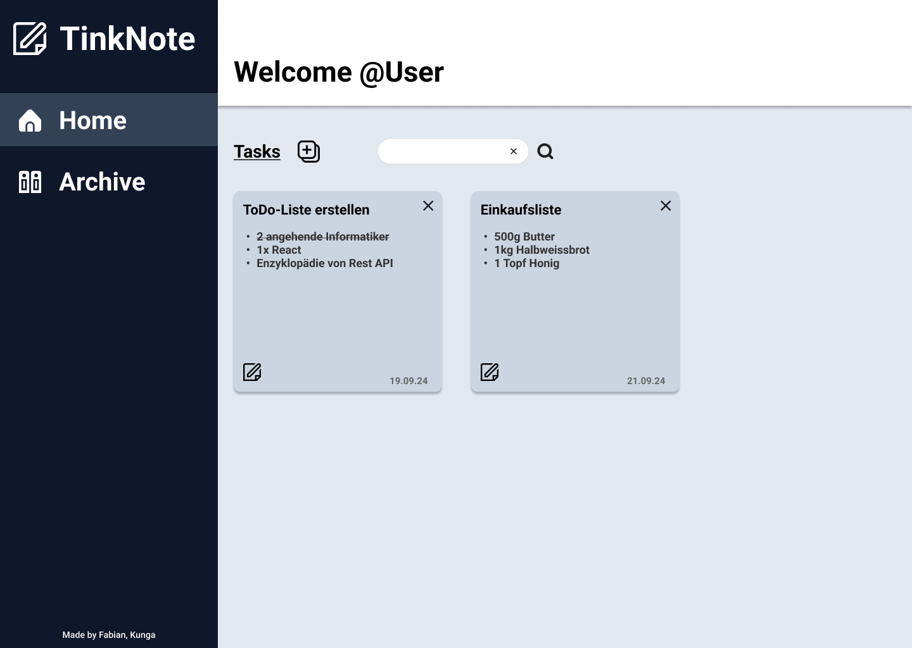
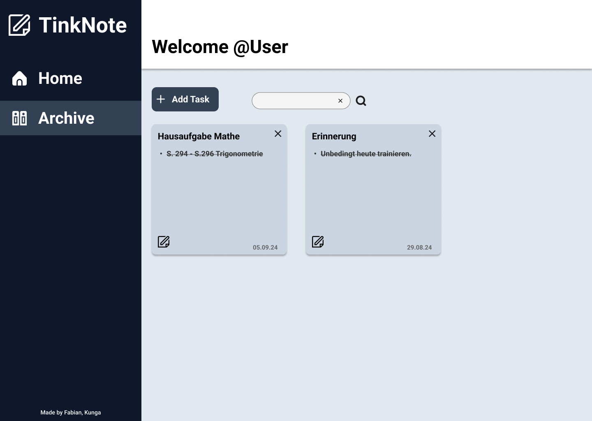
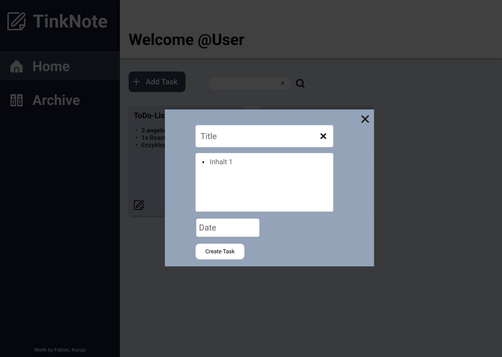

# Projekt Todo-Liste mit Backend

## Inhaltsverzeichnis
- [Projekt Todo-Liste mit Backend](#projekt-todo-liste-mit-backend)
  - [Inhaltsverzeichnis](#inhaltsverzeichnis)
  - [Projektidee](#projektidee)
  - [Anforderungskatalog](#anforderungskatalog)
    - [Funktionale Anforderungen](#funktionale-anforderungen)
    - [Nicht-funktionale Anforderungen](#nicht-funktionale-anforderungen)
    - [Technische Anforderungen](#technische-anforderungen)
  - [Komponentendiagramm](#komponentendiagramm)
  - [Storyboard](#storyboard)
    - [Home](#home)
    - [Archive](#archive)
    - [Task Creation](#task-creation)
  - [Hilfestellungen](#hilfestellungen)

## Projektidee

Unser Team möchte eine ToDo-Listen Applikation erstellen, mit deren Hilfe der User unterschiedlichste Aufgaben notieren kann in den verschiedensten Kategorien. Er soll die Möglichkeit haben eine TodoListe zu erstellen, zu bearbeiten und zu löschen. Zusätzlich soll der User auf dem Home Startseite einen Überblick erhalten über alle seine pendenten Aufgaben die er für sich erstellt hat. Mithilfe der Rest API soll die Applikation zusätzlich die erstellten Listen abspeichern, damit der User diese im nächsten Male wieder direkt abrufen kann.

<!---Hier muss noch mehr geschrieben werden für die Projektidee mind. halbe A4 Seite-->

Folgende User Stories haben wir erstellt in Anbetracht unserer Idee inklusive Akzeptanzkriterien:

**Als User möchte ich einen Überblick zu meine Aufgaben haben um besser strukturiert zu sein.**

<ins>Akzeptanzkriterien</ins>
- Der User sieht einen Dashboard mit allen seinen aktuellen offenen Listen.
- Aufgaben sind unterteilt in Offene Aufgaben und erledigte Aufgaben.
- Der User kann die Aufgaben mithilfe eines Suchtextfilters filtern um diese schneller zu finden.
- Die Anzahl der offenen und erledigten Aufgaben wird angezeigt. (optional)
- Aufgaben werden nach Datum sortiert angezeigt. (optional)
- Das Dashboard hat eine Kalenderfunktion mit diesem der User die Aufgabenlisten der Tage prüfen kann. (optional)

**Als User möchte ich neue Aufgaben erstellen, bearbeiten, löschen oder als erledigt markieren um meinen Tag zu planen.**

<ins>Akzeptanzkriterien</ins>
- Der User kann eine neue ToDo Liste erstellen mit Titel, Beschreibung und Datum anlegen.
- Nach dem Erstellen der Liste soll diese in der Applikation ersichtlich sein.
- Der User kann eine bestehende Aufgabe bearbeiten (Titel, Beschreibung und Datum).
- Die geänderte Liste soll in der Applikation ersichtlich sein.
- Der User kann eine Aufgabe löschen und die Aufgabe verschwindet aus der Liste.
- Der User kann eine Aufgabe als erledigt markieren und die Aufgabe wechselt in die Kategorie Erledigte Aufgaben.
- Alle Inputfelder müssen Pflichtfelder sein. Wenn eines fehlt soll der User darüber informiert werden.
- Der User kann eine erledigte Aufgabe wieder rückgängig machen im Falle eines Versehens. (optional)

## Anforderungskatalog

### Funktionale Anforderungen

- User sieht Übersicht aller offenen Aufgaben
- Aufgaben werden nach Datum sortiert
- Der User kann eine neue Aufgabenliste erstellen mit einem Titel, Beschreibung und Datum.
- Der User kann bestehende Aufgaben anpassen.
- Der User kann Aufgaben endgültig löschen.
- Der User kann Aufgaben als erledigt markieren.
- Der User kann Aufgaben suchen, um schnell bestimmte Einträge zu finden.
- Die Anwendung nutzt Rest API um Aufgaben zu erstellen.

### Nicht-funktionale Anforderungen

- Benutzeroberfläche soll intuitiv und einfach zu bedienen sein.
- Der Code soll möglichst wartbar sein, um Ihn später eventuell erweitern zu können.

### Technische Anforderungen

- React 18
- Verwendung von useState() und useEffect() wie gelernt im Unterricht.
- korrektes Routing eingesetzt
- REST API 
- Erfolgt mithilfe von Git/Github

## Komponentendiagramm

<!--Hier das Komponentendiagramm hinzufügen-->

## Storyboard

### Home

### Archive

### Task Creation

## Hilfestellungen

 - [Inhaltsverzeichnis erstellen innerhalb eines Markdown Files](https://stackoverflow.com/questions/11948245/markdown-to-create-pages-and-table-of-contents#27953547)
- [Farbpalette für unsere ToDo-Liste](https://coolors.co/palettes/popular/0f172a)
- [Website für unsere Icons](https://www.flaticon.com/icon-fonts-most-downloaded)
- [Prototyp erstellt mithilfe von Figma](https://www.figma.com/design/PHtCBMsnAXXkurCZracm7Y/Untitled?node-id=0-1&node-type=canvas&t=deJsHoNP8Yqy9c5D-0)
- [CSS Strukturierung BEM](https://css-tricks.com/bem-101/)
- [MongoDB Rest API von diesem Repository genutzt](https://github.com/WISS-GB/M294-MongoDB-API)
