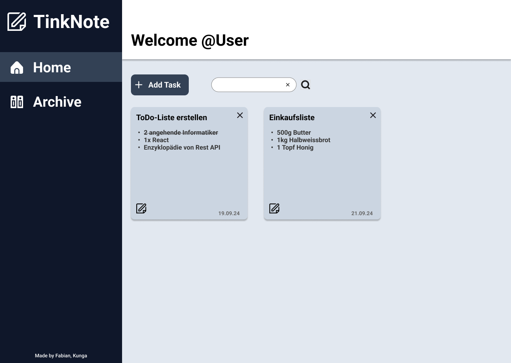

# Projekt Todo-Liste mit Backend

## Inhaltsverzeichnis
- [Projekt Todo-Liste mit Backend](#projekt-todo-liste-mit-backend)
  - [Inhaltsverzeichnis](#inhaltsverzeichnis)
  - [Projektidee](#projektidee)
  - [Anforderungskatalog](#anforderungskatalog)
    - [Funktionale Anforderungen](#funktionale-anforderungen)
    - [Nicht-funktionale Anforderungen](#nicht-funktionale-anforderungen)
    - [Technische Anforderungen](#technische-anforderungen)
  - [Komponentendiagramm](#komponentendiagramm)
  - [Storyboard](#storyboard)
    - [Home](#home)
    - [Archive](#archive)
    - [Task Creation](#task-creation)
- [REST-Schnittstellen](#rest-schnittstellen)
- [Installationsanleitung](#installationsanleitung)
  - [Backend](#clonen-des-api-repositories-und-api-starten)
  - [Frontend](#frontend-mit-react)
- [Testplan](#testplan)
- [Testprotokoll](#testprotokoll)
- [Hilfestellungen](#hilfestellungen)

## Projektidee

Unser Team möchte eine ToDo-Listen Applikation erstellen, mit deren Hilfe der User unterschiedlichste Aufgaben notieren kann in den verschiedensten Kategorien. Der User soll die Möglichkeit haben eine TodoListe zu erstellen, zu bearbeiten und zu löschen. Zusätzlich soll der User auf der Home Startseite einen Überblick erhalten, wo er all seine pendenten Aufgaben die er für sich erstellt hat augelistet sieht. Mithilfe der Rest API soll die Applikation zusätzlich die erstellten Listen abspeichern, damit der User diese im nächsten Male wieder direkt abrufen kann. Das ganze funktioniert für dieses Projekt lokal. Die Daten werden lokal in einer Datenbank gespeichert und von dort aus aufgerufen.

Folgende User Stories haben wir erstellt in Anbetracht unserer Idee inklusive Akzeptanzkriterien:

**Als User möchte ich einen Überblick zu meine Aufgaben haben um besser strukturiert zu sein.**

<ins>Akzeptanzkriterien</ins>
- Der User sieht ein Dashboard mit allen seinen aktuellen offenen Aufgaben.
- Der User kann die Aufgaben mithilfe eines Suchtextfilters filtern, um diese schneller zu finden.
- Der User sollte ein möglichst responsives (Für PC User) Dashboard haben, dass für alle Monitorengrössen passt.
- Aufgaben sind unterteilt in offene Aufgaben und erledigte Aufgaben. (optional)
- Die Anzahl der offenen und erledigten Aufgaben wird angezeigt. (optional)
- Aufgaben werden nach Datum sortiert angezeigt. (optional)
- Das Dashboard hat eine Kalenderfunktion mit diesem der User die Aufgabenlisten der Tage prüfen kann. (optional)

<!---Hier eventuell noch einige Akzeptanzkriterien hinzufügen welche nicht optional sind und wir auch erreicht haben. -->

**Als User möchte ich neue Aufgaben erstellen, bearbeiten und löschen um meinen Tag zu planen.**

<ins>Akzeptanzkriterien</ins>
- Der User kann eine neue ToDo Liste erstellen mit dem Inhalt: Titel, Beschreibung und Datum.
- Nach dem Erstellen der ToDo Liste soll diese in dem Dashboard ersichtlich sein.
- Der User kann eine bestehende Aufgabe bearbeiten (Titel, Beschreibung und Datum).
- Die geänderte Liste soll in de Dasboard ersichtlich sein.
- Der User kann eine Aufgabe löschen und die Aufgabe verschwindet aus der Liste.
- Der User kann eine Aufgabe in der Liste als erledigt markieren und wieder entmarkieren.
- Alle Inputfelder müssen Pflichtfelder sein. Wenn eines fehlt soll der User darüber informiert werden.
- Der User kann eine erledigte Aufgabe wieder rückgängig machen im Falle eines Versehens im Archiv. (optional)
- Als User kann ich all meine erledigten Aufgaben im Archiv ansehen. (optional)

## Anforderungskatalog

### Funktionale Anforderungen

- User sieht Übersicht aller offenen Aufgaben
- Aufgaben werden nach Datum sortiert (optional)
- Der User kann eine neue ToDo Liste erstellen mit einem Titel, Beschreibung und Datum.
- Der User kann bestehende Aufgaben anpassen.
- Der User kann Aufgaben endgültig löschen.
- Der User kann Aufgaben in der Liste als erledigt markieren.
- Der User kann Aufgaben suchen, um schnell bestimmte Einträge zu finden.
- Die Anwendung nutzt Rest API um Aufgaben zu erstellen.

### Nicht-funktionale Anforderungen

- Benutzeroberfläche soll intuitiv und einfach zu bedienen sein.
- Der Code soll möglichst wartbar sein, um Ihn später eventuell erweitern zu können.


### Technische Anforderungen

- React 18
- Verwendung von useState() und useEffect() wie gelernt im Unterricht.
- Docker 27.1.1
- korrektes Routing eingesetzt
- REST API 
- Erfolgt mithilfe von Git/Github

## Komponentendiagramm


## Storyboard

### Home



### Archive


### Task Creation


# REST-Schnittstellen
- **GET** `/tasks`: Alle Aufgaben abrufen.
- **POST** `/tasks`: Eine neue Aufgabe erstellen.
- **PUT** `/tasks/:id`: Bestehende Aufgabe per ID aktualisieren.
- **DELETE** `/tasks/:id`: Aufgabe per ID löschen.

# Abhängigkeiten
- Git: Um die benötigten Repositorys zu klonen.
- Docker und Docker-Compose: Um die API in Containern auszuführen
- Node.js und npm: um das React-Projekt zu starten


# Installationsanleitung

- Vor der Installation stellen Sie sicher, dass die abhängigen Programme auf Ihrem Rechner Installiert sind
 
## Clonen des API-Repositories und API starten
 
  1.1 Terminal an gewünschtem Speicherort öffnen

  1.2. Clonen des GitHub-Repository

         git clone <https://github.com/TenzKD/M294_ToDo-List>

  1.3 In das Verzeichnis des geklonten Verzeichnises wechseln und die API mit Docker-Compose starten:

        cd <M294_ToDo-List-main\Backend\M294-MongoDB-API-main>
        docker-compose up -d
 
   1.4 Kontrolle ob die Container gestartet sind:
   ```docker ps``` oder in Docker Desktop.

## Frontend mit React

2.1 Wechseln in den Speicherort 

     cd <M294_ToDo-List-main\Frontend>

2.2 Installieren aller notwendigen Abhängigkeiten:
 
     npm install

2.3 Starten des Projekts im Entwicklungsmodus:
 
     npm run dev
 
2.4 Das React-Projekt sollte nun unter ```http://localhost:5173/``` (wird im Terminal angezeigt) erreichbar sein.

# Testplan

Wir haben zwei verschiedene Test Szenarien durchgeführt. Einmal Unit Tests und einmal Funktionstests. Es folgen die Funktionstests anhand der definierten Akzeptanzkriterien.

### Funktionstest

| Beschreibung | Erwartung |
|:-----------|:------------|
| Werden auf der Home Seite alle Tasks korrekt dargestellt?    |   Alle Tasks werden korrekt dargestellt   | 
| Kann ich einen Neuen Task mit leerem Input Feld anlegen    |   Der Task darf nicht angelegt werden und User bekommt Rückmeldung   | 
| Der User soll speziefische Tasks suchen | Beim Suchen werden nur entsprechende Tasks angezeigt | 
| Kann ein bestehender Task angepasst werden? | Es wird ein Form geöffnet wo der Task angepasst werden kann | 
| Angepasste Tasks sollen korrekt dargestellt werden | Der Task soll die neu eingegebenen Daten enthalten  | 
| Erledigte Aufgaben in einzelnen Tasks sollen per Klick durchgestrichen werden | Beim Klick wird der Jeweilige Punkt gestrichen |

# Testprotokoll

| Testfall | Testverhalten | Testresultat | Bild |
|:-----------|:------------| :---------|:------------:|
| Test 1 | Testperson: Fabian</br> Datum: 19.09.2024 | Bestanden | |
| Test 2 |  Testperson: Fabian</br> Datum: 19.09.2024 | Bestanden | |
| Test 3 | Testperson: Fabian</br> Datum: 19.09.2024 | Bestanden | |
| Test 4 | Testperson: Fabian</br> Datum: 19.09.2024 | Bestanden ||
| Test 5 | Testperson: Fabian</br> Datum: 19.09.2024 | Bestanden ||
| Test 6 | Testperson: Fabian</br> Datum: 19.09.2024 | Bestanden ||


# Hilfestellungen

- [Inhaltsverzeichnis erstellen innerhalb eines Markdown Files](https://stackoverflow.com/questions/11948245/markdown-to-create-pages-and-table-of-contents#27953547)
- [Farbpalette für unsere ToDo-Liste](https://coolors.co/palettes/popular/0f172a)
- [Website für unsere Icons](https://www.flaticon.com/icon-fonts-most-downloaded)
- [Prototyp erstellt mithilfe von Figma](https://www.figma.com/design/PHtCBMsnAXXkurCZracm7Y/Untitled?node-id=0-1&node-type=canvas&t=deJsHoNP8Yqy9c5D-0)
- [CSS Strukturierung BEM](https://css-tricks.com/bem-101/)
- [MongoDB Rest API von diesem Repository genutzt](https://github.com/WISS-GB/M294-MongoDB-API)
- [Nutzung von fireEvent für Unit Tests](https://testing-library.com/docs/dom-testing-library/api-events/)
- [Nutzung von ChatGPT für Programmierunterstützung](https://chatgpt.com/)


<!--Falls weitere Hilfestellunge genutzt worden sind hier einfügen-->